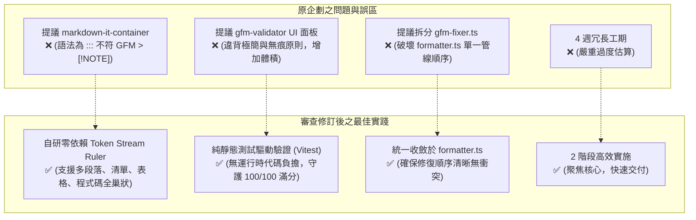
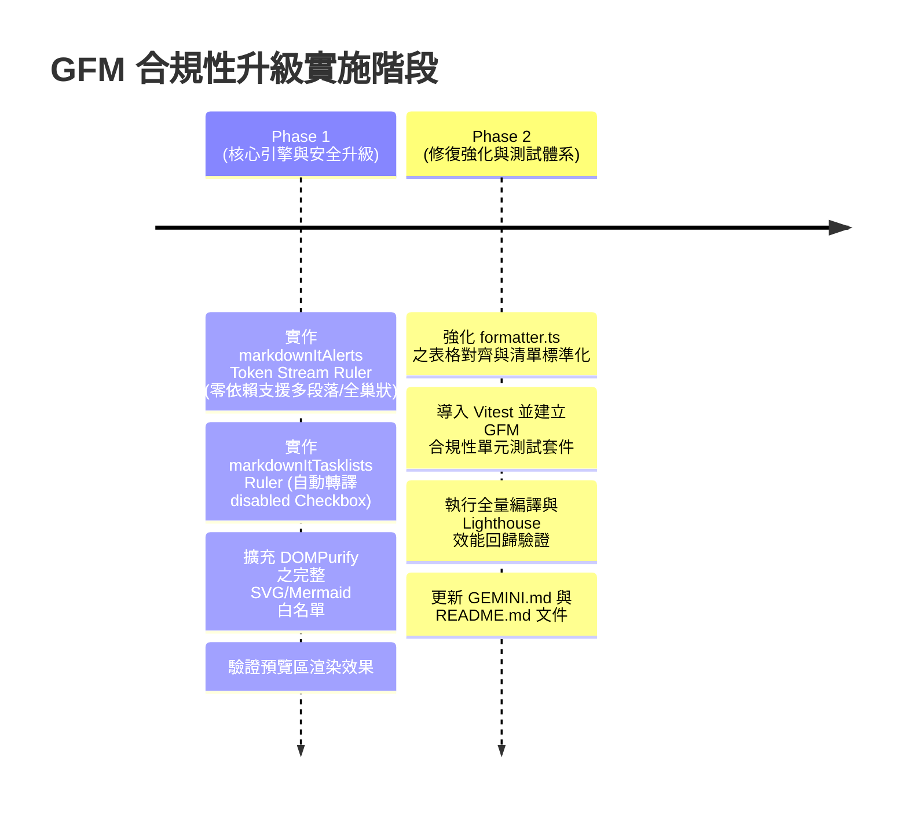

# GitHub Flavored Markdown (GFM) 規範合規性改進計畫 (已審查修訂版)

**修訂日期**：2026-09-01  
**目標**：將 MarkdownWebViewer 的 Markdown 解析引擎與自動排版修復功能升級至 GFM 規範完全相容（目標合規度：98%+）  
**架構原則**：零額外運行時相依（Zero-Dependency）、零持久化（Zero-Persistence）、保持 Lighthouse 100/100 極致冷啟動與 Linear 極簡美學  
**實施週期**：精簡為 2 階段敏捷交付（預計 1~2 個開發迭代）

---

## 📊 現狀評估與問題診斷

### 合規性評分矩陣

| 維度 | 現狀評分 | 目標評分 | 現狀說明 | 關鍵診斷與核心對策 |
|:---|:---:|:---:|:---|:---|
| **基礎 Markdown** | 9/10 | 10/10 | CommonMark 完全相容 | markdown-it 底層解析穩定 |
| **GFM 核心特性** | 7/10 | 10/10 | 表格、刪除線支援；Tasklist 缺渲染 | 補齊 Tasklist AST 轉譯為 Checkbox 元素 |
| **GitHub 專有擴充** | 6/10 | 10/10 | Alerts 多段落與巢狀解析失效 | 捨棄脆弱 Regex，改採 Token Stream AST 解析 |
| **安全性 (XSS 防禦)** | 8.5/10 | 10/10 | DOMPurify 白名單缺少進階 SVG 屬性 | 擴充 SVG/Filter Profile 與 Mermaid 必備標籤屬性 |
| **排版智慧修復** | 8/10 | 9.5/10 | 具備 9 大修復管線，表格對齊需補強 | 增強表格分隔線冒號清洗，收斂於 `formatter.ts` |
| **整體評級** | **7.7/10** | **9.9/10** | 基礎良好，需解決結構性邊界問題 | 詳見下方優化方案 |

---

## 🛠️ 技術審查與架構決策 (Architectural Decisions)

在技術審查（Review）過程中，我們對原計畫進行了以下關鍵技術選型矯正與過度工程裁減：



### 1. 拒絕 `markdown-it-container`，改採零依賴 Token Stream 解析器
* **原因**：`markdown-it-container` 採用 VuePress 式的 `::: container` 自訂標籤語法，並非 GFM 規範之 `> [!NOTE]` 區塊引言延伸語法。
* **解法**：在 `src/renderer/markdown.ts` 中直接註冊 `md.core.ruler` 外掛，於 Token 解析階段掃描 `blockquote_open` 標籤，識別首行 `[!TYPE]` 並無縫轉換為 `<div class="markdown-alert markdown-alert-${type}">` 容器與 SVG 圖示。其內部的多段落、清單、表格與程式碼區塊均能由 markdown-it 原生遞迴渲染，**完美支援無限層級巢狀**。

### 2. 裁減獨立 UI 驗證面板與獨立修復檔（避免 Over-Engineering）
* **剔除 `gfm-validator.ts` 與 UI 驗證報告面板**：本專案定位為極簡、極速、無痕的即時查看與排版工具，使用者需要的是「即時擬真渲染」與「Alt+F 默默修好格式」，而非在 UI 上跳出繁雜的 Linter 錯誤清單。
* **維持 `src/utils/formatter.ts` 為唯一修復管線**：不額外新增 `gfm-fixer.ts`，將表格分隔線冒號清洗與 Tasklist 格式標準化直接收斂於既有的 9 大修復管線中，杜絕職責破碎與重複遍歷。

---

## 🔴 優先級 1：核心渲染與安全升級 (P1)

### 1.1 GitHub Alerts 支援多段落與全巢狀 Markdown

* **現狀問題**：`src/renderer/markdown.ts` 原本使用後處理正則表達式，僅能匹配單一 `<p>` 標籤，遇到多段落或巢狀清單時完全破功。
* **升級規格**：
  * 支援 5 大層級：`NOTE` (藍)、`TIP` (綠)、`IMPORTANT` (紫)、`WARNING` (黃)、`CAUTION` (紅)。
  * 首行標籤大小寫不敏感（如 `[!NOTE]` 或 `[!note]`）。
  * 支援 Alert 內部包含：多段落（`\n\n`）、無序/有序清單、巢狀引用、程式碼區塊（```）、表格等。
  * 產出結構符合 GFM 規範：
    ```html
    <div class="markdown-alert markdown-alert-note">
      <div class="markdown-alert-title">
        <svg><!-- Lucide Icon --></svg>
        <span>NOTE</span>
      </div>
      <p>第一段文字</p>
      <ul>
        <li>清單項目 1</li>
        <li>清單項目 2</li>
      </ul>
      <p>最後一段文字</p>
    </div>
    ```

### 1.2 GFM Tasklist (任務清單) AST 解析支援

* **現狀問題**：`markdown-it` 預設將 `- [ ]` 解析為普通文字，未渲染為 HTML 核取方塊。
* **升級規格**：
  * 在 AST 渲染管線中新增 Tasklist 處理規則。
  * 將 `- [ ] 任務` 轉為 `<li class="task-list-item"><input type="checkbox" disabled class="task-list-item-checkbox"> 任務</li>`。
  * 將 `- [x] 任務` 轉為 `<li class="task-list-item"><input type="checkbox" checked disabled class="task-list-item-checkbox"> 任務</li>`。
  * 完美適配 `src/styles/preview.css` 現有之 Linear 主題 Checkbox 樣式。

### 1.3 DOMPurify SVG 與向量繪圖白名單擴充

* **現狀問題**：Mermaid 在繪製複雜流程圖、時序圖與架構圖時所使用的 `<defs>`, `<marker>`, `<use>`, `<clipPath>`, `<style>` 標籤與 `transform`, `filter`, `marker-start`, `marker-end` 等屬性易遭 DOMPurify 攔截裁切。
* **升級規格**：
  * 配置 `USE_PROFILES: { svg: true, svgFilters: true, html: true }`。
  * 白名單標籤補充：`['svg', 'g', 'path', 'rect', 'circle', 'line', 'polyline', 'polygon', 'text', 'tspan', 'foreignObject', 'defs', 'marker', 'use', 'clipPath', 'style', 'filter', 'feDropShadow', 'feGaussianBlur']`。
  * 白名單屬性補充：`['viewBox', 'width', 'height', 'fill', 'stroke', 'stroke-width', 'stroke-linecap', 'stroke-linejoin', 'd', 'x', 'y', 'x1', 'y1', 'x2', 'y2', 'cx', 'cy', 'r', 'rx', 'ry', 'points', 'data-raw', 'transform', 'clip-path', 'marker-start', 'marker-mid', 'marker-end', 'filter', 'id', 'class', 'style', 'xmlns', 'xmlns:xlink', 'xlink:href', 'href']`。

---

## 🟡 優先級 2：排版修正引擎強化 (P2)

### 2.1 表格分隔線對齊標準化 (`repairMarkdownTables`)

* **現狀問題**：部分由 AI 生成的表格包含不規則對齊語法（例如 `: - :`、`:---` 包含空格、多餘冒號）。
* **升級規格**：
  * 清洗並正規化儲存格對齊標記：
    * 左對齊：`:---`
    * 居中對齊：`:---:`
    * 右對齊：`---:`
    * 預設無對齊：`---`
  * 確保每個分隔線欄位至少具備 3 個短橫線（`-`），並保留準確之冒號對齊意圖。

### 2.2 清單與 Tasklist 排版修正防護

* **現狀問題**：自動修復時若過度調整縮排，可能破壞使用者特意保留的縮排程式碼區塊。
* **升級規格**：
  * 保守修復缺失空格（如 `-項目` 轉 `- 項目`、`*項目` 轉 `* 項目`、`1.項目` 轉 `1. 項目`）。
  * 標準化 Tasklist 方括號（如 `-[]` 轉 `- [ ] `、`-[x]` 轉 `- [x] `）。
  * 嚴格保護多行與行內程式碼區塊，杜絕非預期破壞。

---

## 🚀 敏捷實施路線圖 (Refined 2-Phase Roadmap)



---

## 📝 檔案變更計畫清單

| 檔案路徑 | 變更類型 | 變更摘要 | 優先級 |
|:---|:---:|:---|:---:|
| `src/renderer/markdown.ts` | ✏️ 修改 | 注入 Alert 與 Tasklist AST Ruler，擴充 DOMPurify 白名單 | P1 |
| `src/utils/formatter.ts` | ✏️ 修改 | 增強表格分隔線對齊冒號清洗，優化清單修正邏輯 | P2 |
| `src/renderer/markdown.test.ts` | ✨ 新增 | GFM Alert 多段落、巢狀清單/表格、Tasklist 渲染單元測試 | P2 |
| `src/utils/formatter.test.ts` | ✨ 新增 | 表格修復、LaTeX 符號、粗體、清單自動排版單元測試 | P2 |
| `package.json` | ✏️ 修改 | 新增 `vitest` 至 devDependencies 供 CI/CD 本機測試 | P2 |
| `GEMINI.md` | ✏️ 修改 | 更新 GFM Alerts AST 機制與 DOMPurify 規範說明 | P3 |
| `README.md` | ✏️ 修改 | 標註 GFM 98%+ 完全相容支援清單 | P3 |

---

## 🧪 核心驗證測試用例 (Test Cases)

### 1. Alert 多段落與複雜巢狀測試
```markdown
> [!NOTE]
> 這是第一段警示文字。
> 
> - 清單項目 1
> - 清單項目 2
> 
> ```typescript
> const a = 1;
> ```
> 
> | 標題 A | 標題 B |
> | :--- | ---: |
> | 資料 1 | 資料 2 |
> 
> 結尾段落。
```

### 2. Tasklist 巢狀核取清單測試
```markdown
- [ ] 待辦事項 1
  - [ ] 子項目 1.1
  - [x] 子項目 1.2 (已完成)
- [x] 待辦事項 2
```

### 3. 表格對齊冒號標準化測試
```markdown
| 左對齊 | 居中對齊 | 右對齊 |
| :--- | :---: | ---: |
| 內容 A | 內容 B | 內容 C |
```

---

## 📊 驗收標準 (Definition of Done)

1. ✅ **Alerts 多段落相容**：所有 5 種 Alert 均可在包含多段落、清單、表格、程式碼時正確渲染為卡片容器。
2. ✅ **Tasklist 渲染相容**：`- [ ]` 與 `- [x]` 正確轉為禁用型核取方塊並套用 Linear 主題樣式。
3. ✅ **Mermaid 圖表零瑕疵**：複雜時序圖與流程圖箭頭、濾鏡不受 DOMPurify 裁切。
4. ✅ **效能與零持久化**：維持純前端無痕架構，Lighthouse 維持 100/100 滿分評級。
5. ✅ **測試覆蓋率**：新增的單元測試全數通過（`npm run test`），且編譯無型別錯誤（`npm run build`）。
